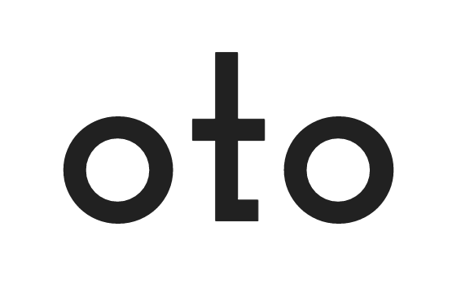

Go driven rpc code generation tool for right now.

* 100% Go
* Describe services with Go interfaces
* Generate server and client code
* Modify the templates to solve your particular needs

## Tutorial

Write your service definition as a Go interface:

```go
package definitions

type GreeterService interface {
  Greet(GreetRequest) GreetResponse
}

type GreetRequest struct {
  Name string
}

type GreetResponse struct {
  Greeting string
}
```

Use the `oto` tool to generate a client and server:

```bash
oto -template ./otohttp/templates/server.go.plush -out ./api/oto.gen.go ./api/definitions
gofmt -w ./api/oto.gen.go ./api/oto.gen.go
```

Implement the service in Go:

```go
package api

type greeterService struct{}

func (greeterService) Greet(ctx context.Context, r GreetRequest) (*GreetResponse, error) {
  resp := &GreetResponse{
    Greeting: "Hello " + r.Name,
  }
  return resp, nil
}
```

Use the generated Go code to write a `main.go` that exposes the server:

```go
func main() {
  g := greeterService{}
  server := otohttp.NewServer()
  RegisterGreeterService(server, g)
  http.Handle("/oto/", server)
  log.Fatal(http.ListenAndServe(":8080", nil))
}
```

Use the generated client to access the service in JavaScript:

```javascript
import { GreeterService } from 'oto.gen.js'

const greeterService = new GreeterService()

greeterService.greet({
  name: "Mat",
})
  .then((response) => alert(response.greeting))
  .catch((e) => alert(e))
```

### Specifying additional template data

You can provide strings to your templates via the `-params` flag:

```bash
oto \
  -template ./otohttp/templates/server.go.plush \
  -out ./api/oto.gen.go 
  -params "key1:value1,key2:value2"
  ./api/definitions
```

Within your templates, you may access these strings with `<%= params["key1"] %>`.

---


